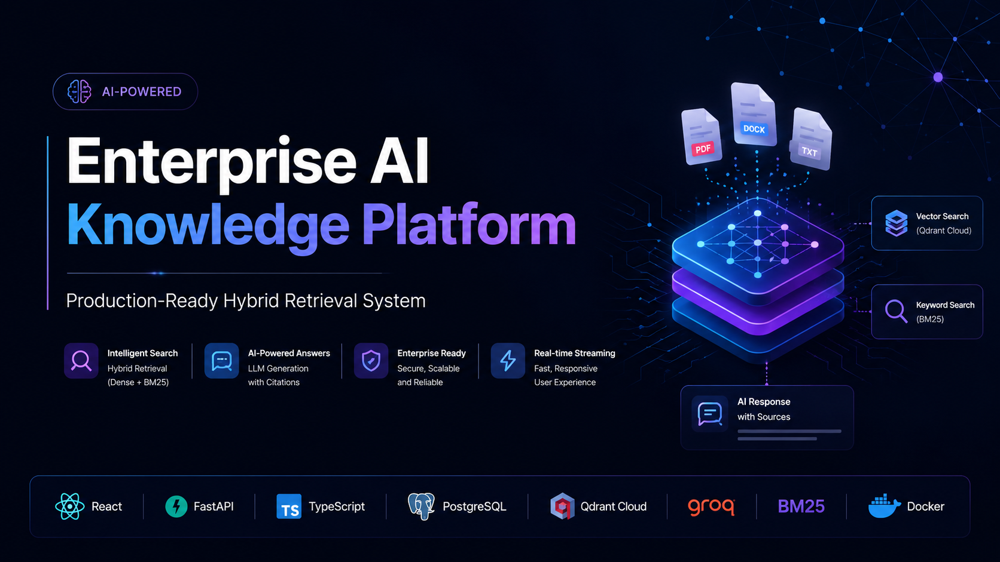
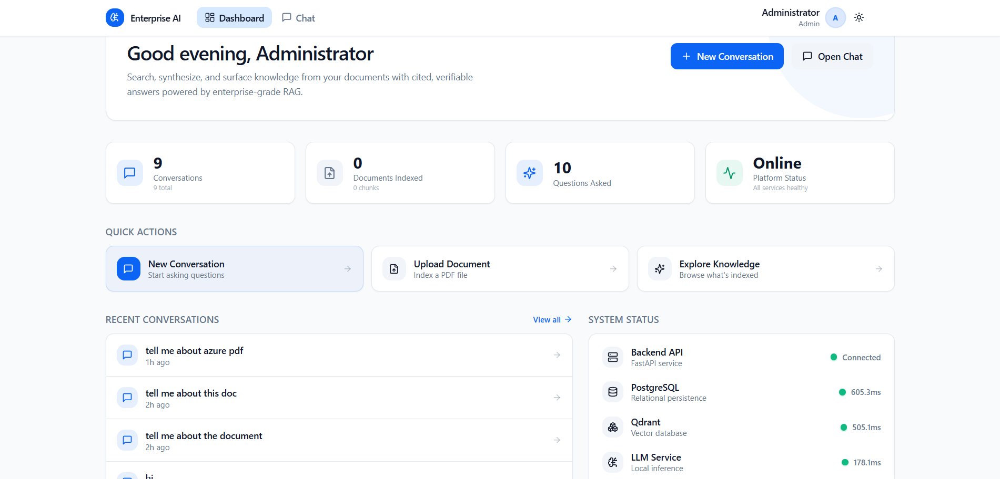
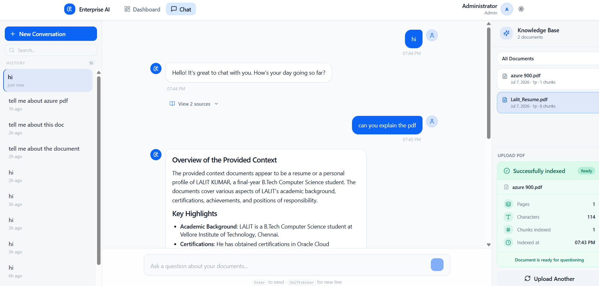
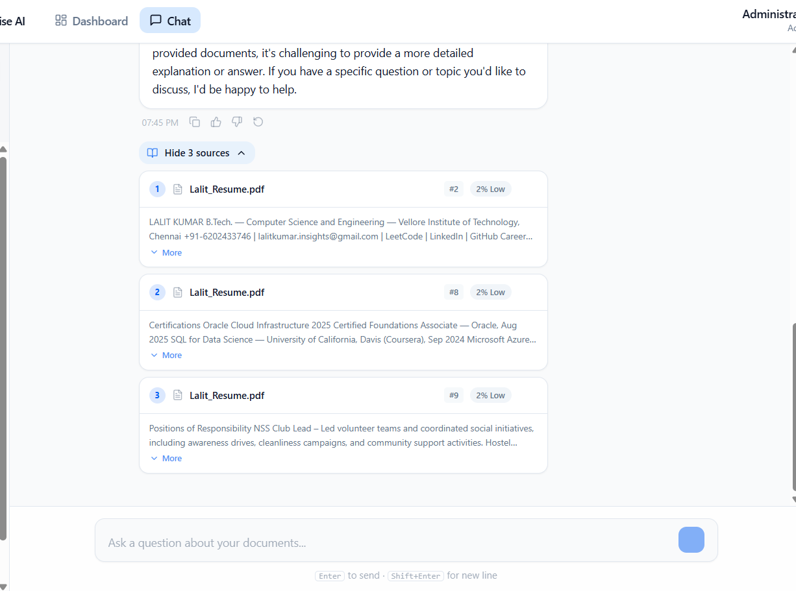
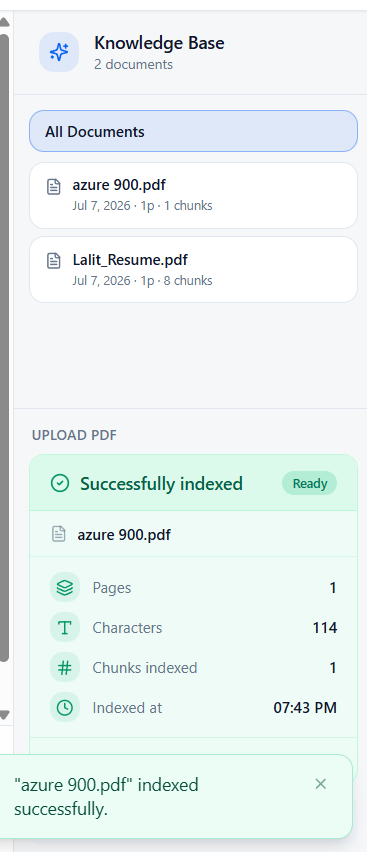
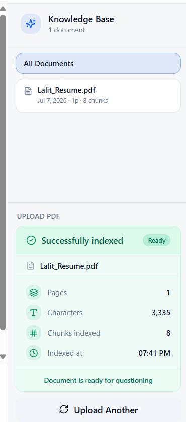
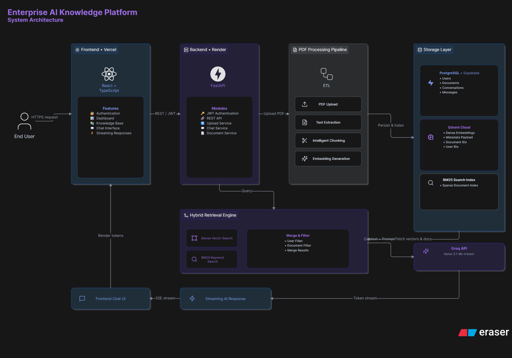
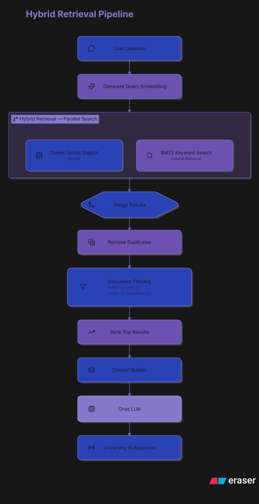
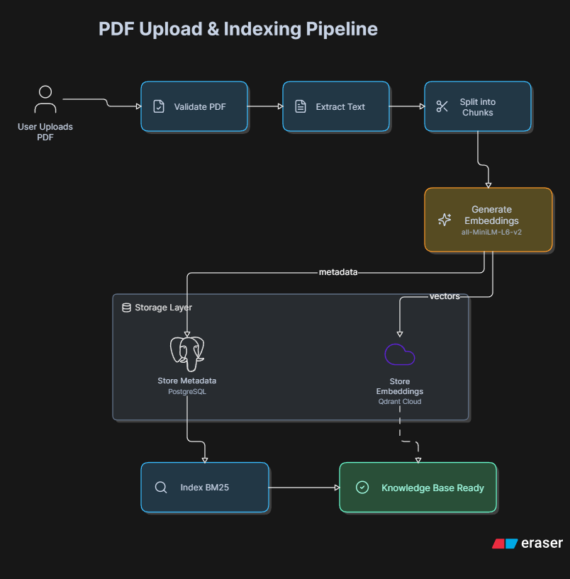
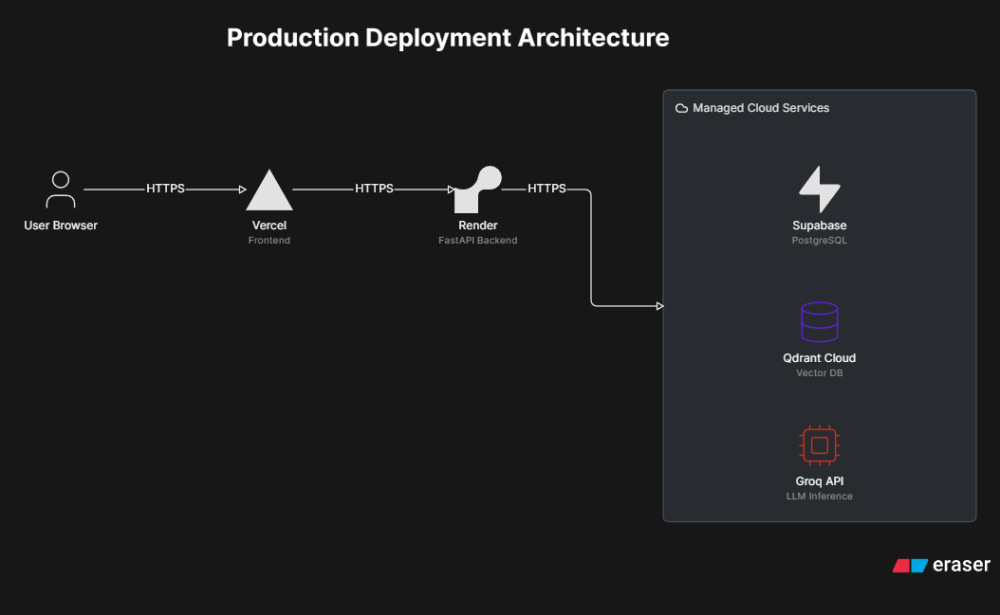

<div align="center">



# Enterprise AI Knowledge Platform

**Production-grade Retrieval-Augmented Generation for organizational knowledge management.**
Upload documents, ask questions in natural language, and get cited, verifiable answers — powered by hybrid dense + sparse retrieval and a real-time streaming LLM pipeline.

[](https://enterprise-rag-kappa.vercel.app)
[](https://fastapi.tiangolo.com)
[](https://react.dev)
[](https://python.org)
[](https://typescriptlang.org)
[](https://qdrant.tech)
[](LICENSE)

[Live Demo](https://enterprise-rag-kappa.vercel.app) · [API Docs](https://enterprise-rag-3x98.onrender.com/docs) · [Setup Guide](docs/SETUP.md) · [Deployment](docs/DEPLOYMENT.md) · [API Reference](docs/API.md)

</div>

---

## Screenshots

### Dashboard


### Chat with Streaming Responses & Citations




### Knowledge Base & Document Management




---

## Architecture

### System Overview


### Hybrid Retrieval Pipeline


### PDF Ingestion Pipeline


### Cloud Deployment


---

## How Hybrid Retrieval Works

Most RAG systems rely on vector search alone. This platform fuses two complementary strategies using **Reciprocal Rank Fusion (RRF)**:

```
Query
 ├── Dense Search  (Qdrant · sentence-transformers)  →  ranked list A
 └── Sparse Search (BM25Okapi · in-memory index)     →  ranked list B
                                      ↓
                        RRF:  score = Σ 1 / (k + rank)
                                      ↓
                         Top-N chunks → LLM → streamed answer + citations
```

| Retrieval type | Semantic similarity | Exact keywords | Rare terms |
|----------------|:-------------------:|:--------------:|:----------:|
| Dense only     | ✅ | ❌ | ❌ |
| BM25 only      | ❌ | ✅ | ✅ |
| **Hybrid**     | ✅ | ✅ | ✅ |

Hybrid search can be toggled via `HYBRID_SEARCH_ENABLED` without redeployment.

---

## Features

**Core RAG**
- Hybrid retrieval — Qdrant dense + BM25 sparse fused via RRF (k=60)
- Real-time token streaming via Server-Sent Events
- Source citations on every answer — filename, chunk, relevance score, preview
- Document-scoped retrieval — query all docs or pin a single document
- Any OpenAI-compatible LLM (Groq, LM Studio, OpenAI, Ollama, vLLM)

**Document Management**
- PDF upload → text extraction → chunking → embedding → dual-indexed
- Knowledge base browser with page count, chunk count, upload date
- Atomic deletion from PostgreSQL, Qdrant, and BM25 corpus

**Conversations**
- Persistent history stored in PostgreSQL
- Rename, delete, and pin conversations
- Full Markdown rendering (tables, code blocks, lists)

**Auth & Access Control**
- Stateless JWT with automatic expiry and logout
- Four RBAC roles: Admin · HR · Finance · Employee
- Route-level guards on both frontend and backend

**Platform**
- `/health/detail` — live per-service status (DB, Qdrant, LLM, BM25)
- `/metrics` — documents, conversations, questions, chunks
- Animated dark/light theme toggle, system-aware
- Responsive layout — mobile sidebar, collapsible panels
- Docker + Docker Compose for local development

---

## Tech Stack

**Backend**

| | Technology |
|-|-----------|
| Framework | FastAPI 0.139 + Uvicorn |
| Language | Python 3.12+ |
| ORM / Migrations | SQLAlchemy 2.0 + Alembic |
| Database driver | psycopg v3 |
| Vector store | Qdrant Cloud |
| Sparse search | rank-bm25 (BM25Okapi) |
| Embeddings | sentence-transformers (`BAAI/bge-m3`, `all-MiniLM-L6-v2`) |
| LLM | OpenAI-compatible REST API |
| Auth | python-jose (JWT) + bcrypt |
| Container | Docker |

**Frontend**

| | Technology |
|-|-----------|
| Framework | React 19 + Vite |
| Language | TypeScript 5 |
| Styling | Tailwind CSS v3 |
| Routing | React Router v7 |
| Icons | Lucide React |
| UI primitives | Radix UI + class-variance-authority |
| Streaming | Fetch SSE with async generators |

**Infrastructure**

| Service | Provider |
|---------|---------|
| Frontend | Vercel |
| Backend | Render (Docker) |
| Vector DB | Qdrant Cloud |
| Relational DB | Supabase / Render PostgreSQL |
| CI/CD | GitHub → Vercel + Render auto-deploy |

---

## Folder Structure

```
enterprise-rag/
├── backend/
│   ├── src/app/
│   │   ├── application/          # Business logic — RAG, auth, conversation services
│   │   ├── domain/               # Pure domain models (User, Conversation, roles)
│   │   ├── infrastructure/       # Adapters — Qdrant, BM25, PostgreSQL, JWT, config
│   │   └── presentation/api/     # FastAPI routes + Pydantic schemas
│   ├── alembic/                  # Database migrations
│   ├── Dockerfile
│   └── requirements.txt
│
├── frontend/
│   ├── src/
│   │   ├── app/                  # Root router
│   │   ├── components/           # Shared layout (AppShell, AppHeader) + UI
│   │   ├── features/             # Feature-folder architecture
│   │   │   ├── auth/             # Login, Register, JWT context, RBAC guards
│   │   │   ├── chat/             # Streaming chat UI, citation cards
│   │   │   ├── conversations/    # Sidebar, history, rename/pin/delete
│   │   │   ├── dashboard/        # Health + metrics dashboard
│   │   │   ├── documents/        # Upload dropzone, knowledge base panel
│   │   │   └── theme/            # Dark/light ThemeProvider
│   │   └── shared/               # API client, toast, config
│   └── vercel.json               # SPA routing + API proxy
│
├── docs/
│   ├── assets/                   # Banner, logo
│   ├── diagrams/                 # Architecture diagrams
│   ├── images/                   # Screenshots
│   ├── API.md                    # Full API reference
│   ├── DEPLOYMENT.md             # Render + Vercel deployment guide
│   └── SETUP.md                  # Environment variables reference
│
└── docker-compose.yml
```

---

## Quick Start

### Prerequisites
- Python 3.12+ · Node.js 18+ · Docker
- An OpenAI-compatible LLM endpoint (Groq, LM Studio, or OpenAI)

### 1. Clone & start infrastructure

```bash
git clone https://github.com/Ayushrana1704/enterprise-rag.git
cd enterprise-rag
docker-compose up -d          # starts PostgreSQL + Qdrant locally
```

### 2. Backend

```bash
cd backend
python -m venv .venv && source .venv/bin/activate   # Windows: .venv\Scripts\activate
pip install torch --extra-index-url https://download.pytorch.org/whl/cpu
pip install -r requirements.txt
cp .env.example .env          # edit LLM_BASE_URL, LLM_API_KEY, DATABASE_URL
alembic upgrade head
uvicorn src.app.main:app --reload --port 8000
```

API at `http://localhost:8000` · Swagger at `http://localhost:8000/docs`

A default admin is seeded: `admin@enterprise.com` / `admin123`

### 3. Frontend

```bash
cd frontend
npm install
npm run dev                   # http://localhost:5173
```

> See [docs/SETUP.md](docs/SETUP.md) for the full environment variable reference and LLM provider examples.
> See [docs/DEPLOYMENT.md](docs/DEPLOYMENT.md) for Render + Vercel production deployment.

---

## Roadmap

- [ ] Multi-file batch upload with progress tracking
- [ ] Cross-encoder reranking pass after RRF fusion
- [ ] Weighted RRF — tunable dense/sparse weights via settings
- [ ] Admin panel — user management, corpus analytics
- [ ] OAuth2 / SSO — Google and Microsoft Entra
- [ ] DOCX and TXT ingestion support
- [ ] Conversation export (PDF / Markdown)
- [ ] OpenTelemetry traces + Grafana dashboards
- [ ] RAGAS-based evaluation harness

---

## License

MIT — see [LICENSE](LICENSE)

---

<div align="center">

**Author:** [Ayush Rana](https://github.com/Ayushrana1704)

Built with FastAPI · React · Qdrant · sentence-transformers · BM25 · PostgreSQL

*Star the repository if this project helped you ⭐*

</div>
